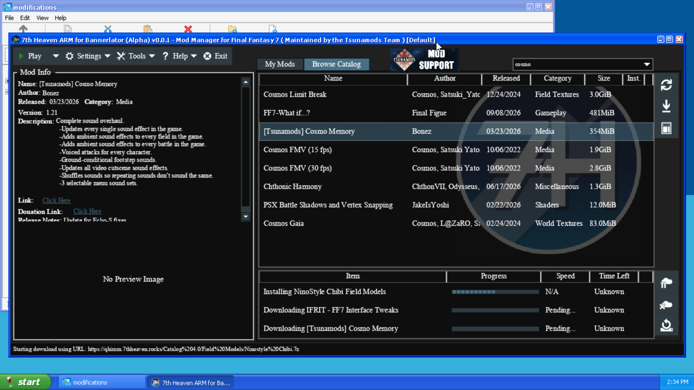

# 7th Heaven ARM for Bannerlator

**v0.7.0 beta — unofficial fork by Cyan.**

This is an experimental ARM64 build of [7th Heaven by Tsunamods and contributors](https://github.com/tsunamods-codes/7th-Heaven) for [Bannerlator](https://github.com/The412Banner/Bannerlator). It is not an official Tsunamods release.

Development is still early: expect occasional crashes while browsing or installing mods and while playing. Crashes in 7th Heaven seem to occur mostly when browing the mod catalog or configuring mods due to how Wine handles the image container. Navigating the UI slowly does reduce this type of crash. This build writes extra diagnostic logs and has only been tested with the setup on my personal device below and targets specifically Proton 11 ARM under Bannerlator 3.13 (also confirmed to work in 3.14).

This fork packages a self-contained ARM64 7th Heaven UI and a private x86 .NET runtime for the FF7 mod loader. Since Android containers cannot properly pass Steam game IDs to containers as a normal windows/linux install would, this loader uses an alternative method to what is used in vanilla 7th Heaven to apply your selected mods by staging them after the Play button is pressed for the next run of FF7 via the shortcut.

## Install in Bannerlator

0. This install guide assumes you are using a FRESH install of Final Fantasy VII (2013) from Steam.
1. Install Final Fantasy VII via Bannerlator and add the shortcut to your container - target the `ff7_en.exe` executable.
2. Be sure to run FF7 at least once so the folders are present inside of the container - you only need to see the initial startup menu, then quit the container.
3. Go into desktop mode for this container and run the **7th Heaven ARM** setup program. The installer includes the ARM64 UI and its private x86 .NET runtime. You can add `7th Heaven.exe` from the installed folder (`C:\users\xuser\AppData\Local\Programs\7th Heaven ARM\7th Heaven.exe`) as a Bannerlator game shortcut in that container or just run it from desktop mode under `Start > All Programs > Programs > 7th Heaven ARM for Bannerlator`.
4. 7th Heaven should automatically find the game path for you; otherwise, browse to the `ff7_en.exe` found inside of the container. If FFNx is not installed, it will automatically download and install on first-run of this mod for you. The mod catalog and Play button are disabled while this install is taking place.
5. Once FFNx installs, you are then able to browse, install, configure, and enable your mods. You can queue several mod downloads, but search and mod list are disabled during a download/install for stability. Once an install is complete, search will function normally.
6. Once mods are installed and configured to your desired settings, press **Play** in 7th Heaven to prepare the mod profile. When 7th Heaven reports that mods are ready at the bottom left of the window, close desktop mode or the 7th Heaven shortcut depending on which you chose.
7. Open the separate FF7 game shortcut in Bannerlator, targeting `ff7_en.exe`, to play with the prepared mods. Repeat steps 2, 4, and 5 after changing mods or settings.

**Clicking play inside of 7th Heaven will need to occur for each run of FF7.**

## Device

This variant was tested exclusively on my device:

`Konkr Pocket Fit G3 Gen 3 with 16 GB of memory`

## Container settings

These are the settings used for the container. You may need different settings depending on device and what is available at the time _aside from unix FEXCORE_:

| Setting                    | Used Value in Testing                       |
| -------------------------- | ------------------------------------------- |
| Wine                       | `Proton-11.0.7.1-arm64ec-9`                 |
| FEX                        | `FEXCore-2609-unix-0`, **Stability** preset |
| DXVK                       | `v3.1-binsem-gplaync-arm64ec-0`             |
| Turnip Driver              | `Mesa Turnip 26.3.0-R5` and `25.3.0-R10`    |
| Audio driver               | Pulse Audio                                 |
| Extra environment variable | `DXVK_DISABLE_TIMELINE_SEMAPHORES=1`        |

**A unix variant of FEXCore is absolutely necessary for this to function properly.** Aside from this, use whatever settings needed to get the game running.

### Game Driver settings

Editable from within 7th Heaven. Changing from default, I was able to use the following settings with no issues:

| Setting                  | Change                                                            |
| ------------------------ | ----------------------------------------------------------------- |
| Resolution               | 1280x720 (Likely can go much higher)                              |
| Window Mode              | Fullscreen                                                        |
| Aspect Ratio             | Widescreen                                                        |
| Advanced Lighting        | Enabled                                                           |
| Auto-size Field Text Box | Enabled                                                           |
| Show FPS                 | Disabled - use the FPS monitoring from your winlator fork instead |
| Show Graphics API        | Disabled - same as above                                          |

### Mods used for testing and settings

| Mod                               | Settings                                                                                                 |
| --------------------------------- | -------------------------------------------------------------------------------------------------------- |
| `Ninostyle Battle` battle models  | Default                                                                                                  |
| `Ninostyle Chibi` field models    | Default                                                                                                  |
| `IFRIT - FF7 Interface Tweaks`    | `Battle Interface` - Revamped `Bottom Battle UI` Enabled, `Avatar` - Slanted, `Intro Logos` - Skip Logos |
| `[Tsunamods] Cosmo Memory` sounds | All fine, but I set menu to Vanilla |

I also separately tested `New Threat 2.0` using default options by Sega Chief with the addition of `IFRIT` using the previously stated settings and it worked as well.

## Status as of current release

I was consistently able to finish the intro sequence getting to the in-game 7th Heaven bar, complete the story sequences there, and save in the `Beginner's Hall` with no issues while in-game. 7th Heaven will often crash when images are being drawn due to how Proton handles the image container, but moving slowly within the app will reduce the crashing.

If 7th Heaven crashes during a mod install but you see it listed under `My Mods` anyway, delete this mod and redownload or you'll have hilarious issues such as only Cloud's head falling off of the train with no body.

Currently, extra logging is enabled to diagnose Wine/FEX issues, and stability varies with mods and settings. The in-app 7th Heaven self-updater is disabled for this variant so an official upstream build cannot replace it. The Bannerlator build installs stock FFNx once when missing, skips automatic startup update checks, and keeps manual FFNx update checks available in General Settings.

## Logs and development status

Bannerlator maps the device Downloads folder as `D:` inside of the container. This fork writes its own logs to `D:\7h-ARM\logs`. Files include `applog.txt`, `7thWrapper.log` (or `log.txt` when using **Play With Debug Log** inside of 7th Heaven), `AppLoader.log`, and `AppProxy.log` if the proxy fails.

Without also building a custom FFNx, the FFNx log always exists inside of the game folder adjacent to ff7_en.exe. This fork copies the previous game run's `FFNx.log` there when 7th Heaven next starts or prepares Play; stock FFNx initially writes that log beside `ff7_en.exe`. Wine debug logs are controlled by Bannerlator and remain in Bannerlator's own log location.

If you wish to share logs, enable the following in the Log Manager inside of Bannerlator (or whatever winlator fork you choose):

| Log Type             | Setting                                            |
| -------------------- | -------------------------------------------------- |
| Folder for Each Game | Enabled                                            |
| Wine Debug           | Enabled, and select `seh`, `module`, and `loaddll` |
| `Box64/FEXCore`      | Enabled                                            |
| Android logcat       | Enabled                                            |
| Crash Reports        | Enabled                                            |

These settings in Bannerlator will create logs in `D:\Bannerlator\{container or shortcut name}` or in the Android file system, `Downloads > Bannerlator > {container or shortcut name}`

If you are crashing in-game, also include your save file as well if the crash is reproducible at the same spot each time.

## Build and attribution

Build the native Win32 `AppLoader` project in Release, then run `tools/Publish-Bannerlator.ps1 -UiRuntimeIdentifier win-arm64 -OutputDirectory .dist/7thHeaven-ARM-v0.7.0-beta-stage` to stage the self-contained build. Run `tools/Build-Bannerlator-Installer.ps1` with Inno Setup 6 available to create the installer. The upstream Visual Studio solution and build instructions are in [the original project](https://github.com/tsunamods-codes/7th-Heaven).

Original 7th Heaven copyright and attribution notices remain in the source. This fork's additions are credited to Cyan. Source is under the [Microsoft Public License](LICENSE.txt); the full license is included with the installer and source. On ARM64 under Wine, 7z mod archives are extracted by the bundled public-domain [LZMA SDK](https://www.7-zip.org/sdk.html) `7zr` tool in a separate process; its notice is included as `7zr-NOTICE.md`. FFNx and other bundled third-party components retain their respective notices and licenses. The original project name is used here to identify the code this fork derives from; this package is independently maintained.
